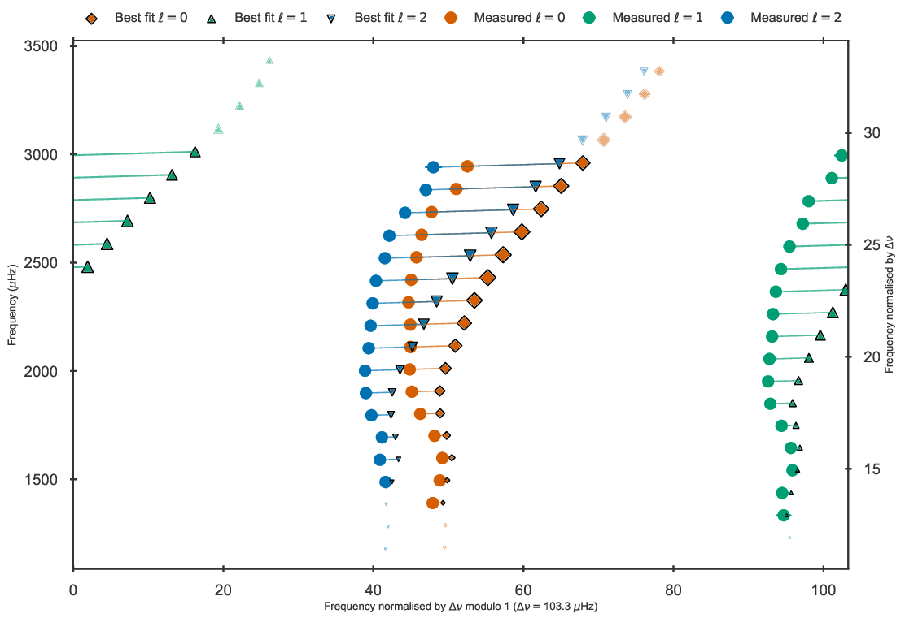
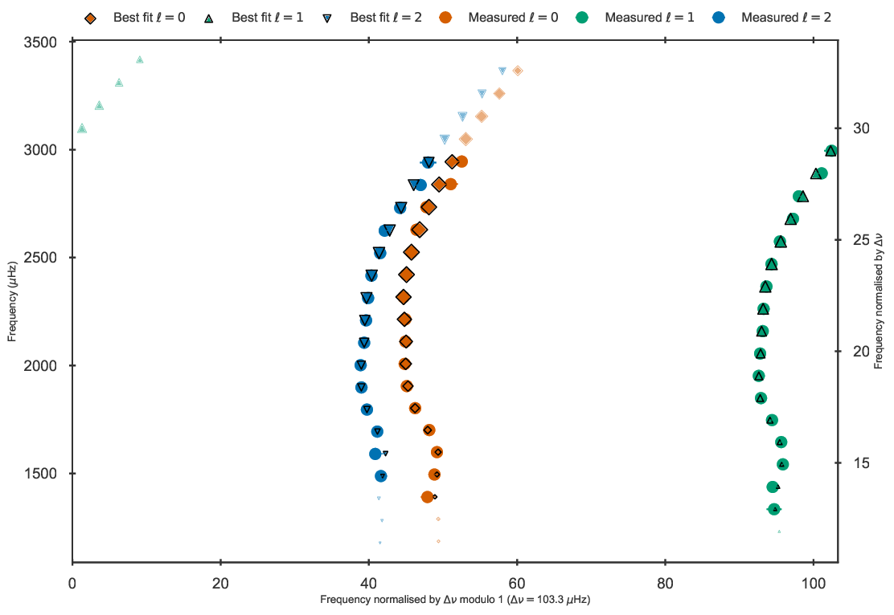
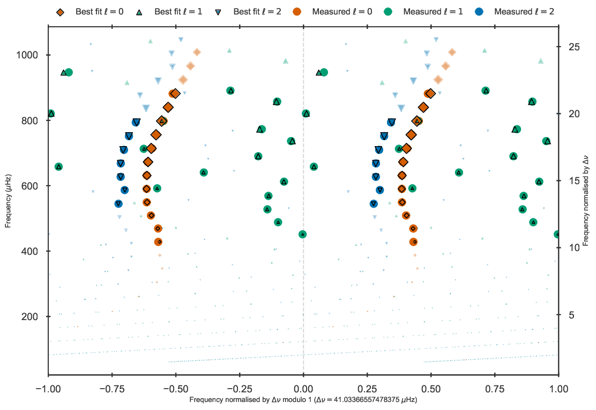

.. _example_freqs:

Methods using individual frequencies
************************************

Using grids that include theoretically computed oscillation frequencies (see :ref:`grids`) BASTA can fit these
individual frequencies with a surface correction, as well as combination of frequencies. In the following we show
examples of the blocks that must be modified in :py:meth:`create_inputfile.define_input` to produce these types of fits.

.. _example_freqs_individual:

Individual frequencies: main sequence
=====================================

BASTA is shipped with individual frequencies for the Kepler main-sequence target 16 Cyg A derived by
`Davies et al. 2015 <https://ui.adsabs.harvard.edu/abs/2015MNRAS.446.2959D/abstract>`_. These are included in the
``ascii`` file ``BASTA/examples/data/freqs/16CygA.fre`` and listed in columns of
(order, degree, frequency, error, flag). To fit these frequencies to a grid of models, the ascii input must be converted
to a suitable ``xml`` file with the routine :py:meth:`fileio.freqs_ascii_to_xml`. Simply run the following commands in
the terminal:

.. code-block:: bash

    cd BASTA
    source venv/bin/activate
    cd examples/data/freqs
    python3
    from basta import fileio; fileio.freqs_ascii_to_xml('.', '16CygA')

Which gives the output:

.. code-block:: text

    Star 16CygA has an epsilon of: 0.8.
    No correction made.

This will produce the file ``16CygA.xml``, which can be used as a direct input in the ``BASTA`` fitting.
The ``ascii`` file must a header naming the different columns and at a minimum the file must contain:

  - the mode frequencies in µHz, typically named `freq` or `frequency` in header
  - the angular degrees l, typically named `l`, `ell` or `degree`
  - the uncertainties of the mode frequenciea in µHz. These can either be
        - symmetrical and thus only a single column with an uncertainty can be given, typically denoted `error` or `err`.
        - asymmetrical. In this case, the upper and lower uncertainty must be given as two separate columns, typically denoted `error_plus` and `error_minus`.

Furthermore, feel free to add a column containing radial orders (`order` or `n`) if these are known.

For convenience, you can check your column of radial orders based on the calculated epsilon value.
This is done by including an additional argument in the ``python`` command:

.. code-block:: bash

    from basta import fileio; fileio.freqs_ascii_to_xml('.', '16CygA', check_radial_orders=True)

This will then output:

.. code-block:: text

    Star 16CygA has an epsilon of: 0.8.
    The proposed correction has been implemented.

BASTA calculates the epsilon (:math:`\epsilon`) term as described in
`White et al. 2012 <https://ui.adsabs.harvard.edu/abs/2012ApJ...751L..36W/abstract>`_ and correct the radial order of
the frequencies accordingly. In this case the radial order of the input frequencies is already appropriate, and thus
BASTA does not change the values of the radial order.

With the input file in the appropriate ``xml`` format, the following blocks must be modified in ``create_inputfile.py``:

.. code-block:: python

    # ==================================================================================
    # BLOCK 2: Fitting control
    # ==================================================================================
    define_fit["fitparams"] = ("Teff", "FeH", "freqs")

    # ------------------------------------------------------------
    # BLOCK 2d: Fitting control, frequencies
    # ------------------------------------------------------------
    define_fit["freqparams"] = {
        "freqpath": "BASTA/examples/data/freqs",
        "fcor": "BG14",
        "correlations": False,
        "dnufrac": 0.15,
    }

    # ==================================================================================
    # BLOCK 4: Plotting control
    # ==================================================================================
    define_plots["freqplots"] = "echelle"

This defines ``freqs`` as a ``fitparam`` in block 2. Block 2d gives the path to the frequency ``xml``-file, sets the
frequency correction from `Ball & Gizon 2014 <https://ui.adsabs.harvard.edu/abs/2014A%26A...568A.123B/abstract>`_,
ignores correlations between individual frequencies, and restricts the lowest l=0 mode from each model to be within 15%
of the value of the observed one.

We have provided an ready-to-run example for this star:

.. code-block:: bash

    cd BASTA
    source venv/bin/activate
    cd examples/xmlinput
    python create_inputfile_freqs.py
    BASTArun input_freqs.xml

The fit should take less than a minute and the output is stored in ``BASTA/examples/output/freqs``. Besides the
corner plot and Kiel diagrams, the code produces output of the fit to the individual frequencies in form of echelle
diagrams for both corrected and uncorrected frequencies:

   Echelle diagram showing the uncorrected frequencies of the best fit model to 16 Cyg A in the grid.

   Echelle diagram after the BG14 frequency correction to the best fit model to 16 Cyg A in the grid.

.. _example_freqs_ratios:

Frequency ratios
================

BASTA also has the option to fit the frequency ratios (:math:`r_{01}, r_{10}, r_{02}, r_{010}, r_{012}`). To do this,
one simply adds the following ``fitparam`` (for the case of :math:`r_{012}` as an example):

.. code-block:: python

    # ==================================================================================
    # BLOCK 2: Fitting control
    # ==================================================================================
    define_fit["fitparams"] = ("Teff", "FeH", "r012")

    # ==================================================================================
    # BLOCK 4: Plotting control
    # ==================================================================================
    define_plots["freqplots"] = "ratios"

The variable ``freqplots`` can also be set to ``True``, which will produce plots of the ratios and corresponding echelle
diagrams even though individual frequencies are not fitted. We provide an example to run this fit in
``BASTA/examples/xmlinput/create_inputfile_ratios.py`` which produces the file ``input_ratios.xml``. Running
this file stores the results of the fit in ``BASTA/examples/output/ratios/``, and the resulting ratios should look
as follows:

   Frequency ratios of the best fit model to 16 Cyg A in the grid.

BASTA uses by default the five-point small frequency separation formulation for computing the ratios, which is the
recommended option. Additionally, interpolation of the model ratios to the observed frequencies are applied in the fit.
Finally, the correlations between the ratios are taken into account by using the full covariance matrix. Any of these
settings can of cource be changed should the user wish to do so.

.. _example_freqs_epsdiff:

Epsilon differences
-------------------

Similar to frequency ratios, BASTA can also fit the surface-independent frequency phase differences, commonly
referred to as epsilon differences (Winther et. al, in preparation). The individual set of differences
(:math:`\delta\epsilon_{01}, \delta\epsilon_{02}`) as well as the combined set can be fitted by adding the
correpsonding keyword to ``fitparams`` (here for the case :math:`\delta\epsilon_{012}`):

.. code-block:: python

    # ==================================================================================
    # BLOCK 2: Fitting control
    # ==================================================================================
    define_fit["fitparams"] = ("Teff", "FeH", "e012")

    # ==================================================================================
    # BLOCK 4: Plotting control
    # ==================================================================================
    define_plots["freqplots"] = "epsdiff"

Adding ``epsdiff`` to ``freqplots`` produces the corresponding figure, which can also generally be produced when
individual frequencies are available. An example of how to run this fit is provided in
``BASTA/examples/xmlinput/create_inputfile_epsilondifference.py`` which produces the file ``input_epsilondifference.xml``.
Running this file stores the results of the fit in ``BASTA/examples/output/epsilon/``, and the resulting
epsilon differences should look as follows:

    Epsilon differences of the best fit model to 16 Cyg A in the grid.

Note that since the determination of epsilon differences relies on interpolating the :math:`\ell=0` epsilons to the frequency locations
of the :math:`\ell=1,2` modes, one would extrapolate the :math:`\ell=0` epsilons if the frequency locations of the
:math:`\ell=1,2` goes outside the interval of the frequency locations of the :math:`\ell=0` modes. These are therefore
excluded, and thus the number of epsilon differences may not be equal to the number of :math:`\ell=1,2` frequencies.

As noted above for the ratios, correlations/covariances are taken into account in the fit.

.. _example_freqs_glitches:

Frequency glitches
==================

*Important: To use this feature, please compile the required modules! Please refer to the installation instructions for help.*

Another feature of BASTA is the fit of frequency glitches related to the He ionisation zones.
These are comprised of three parameters, which are:

#. the average amplitude of the He glitch signature, :math:`\langle A_{He}\rangle\,(\mu Hz)`,
#. the acoustic width of the He glitch signature, :math:`\Delta_{He}\,(s)`,
#. and the acoustic depth of the He glitch signature, :math:`\tau_{He}\,(s)`.

These can be precomputed and provided by the user in ``hdf5`` format, by either computing them using the
`GlitchPy <https://github.com/kuldeepv89/GlitchPy>`_ code, or following the file structure defined within.

If not precomputed, these can be computed from the provided individual frequencies. In this case, the method used in GlitchPy is
adapted, whereby the method by which the glitch parameters are determined needs to be defined in block 2f as e.g.

.. code-block:: python

    # ------------------------------------------------------------
    # BLOCK 2f: Fitting control, glitches
    # ------------------------------------------------------------
    define_fit["glitchparams"] = {
        "method": "Freq",
        "npoly_params": 5,
        "nderiv": 3,
        "tol_grad": 1e-3,
        "regu_param": 7,
        "nguesses": 200,
    }

The number of realisations to use in the MC scheme to derive the observed glitch parameters are set by the ``nrealizations`` keyword
in the ``freqparams`` dictionary (block 2d).

If the glitch parameters are provided in the GlitchPy format, the method by which these were computed will instead be adopted. The file
must be provided as ``*star_id*.hdf5``, in the same directory as the individual frequencies. The ``readglitchfile`` keyword in the
``freqparams`` dictionary (block 2d) can then be set to ``True`` to allow the precomputed glitches to be read.

To produce the fit one simply needs to include the appropriate parameter ``glitches`` in ``fitparams``

.. code-block:: python

    # ==================================================================================
    # BLOCK 2: Fitting control
    # ==================================================================================
    define_fit["fitparams"] = ("Teff", "FeH", "glitches")

The option to fit glitches together with frequency ratios is also provided, whereby the correlations between
the ratios and glitch parameters of the observations are derived and applied. This option is simply enabled by relacing ``glitches`` in
``fitparams`` by the desired frequency ratio sequence preceded by a ``g``, as e.g. ``gr012`` for fitting glitches along with the ``r012``
sequence.

You can find the corresponding python script to produce the input file for this fit in
``BASTA/examples/xmlinput/create_inputfile_glitches.py``. Running this example produces output located in ``BASTA/examples/glitches/``,
where the fitted glitch parameters are shown in ``16CygA_gltches_gr012.png``, which should look as follows:

   Fitted glitch parameters of 16 Cyg A fitted using glitches and ratios.

Individual frequencies: subgiants
=================================

Reproducing the frequency spectrum of subgiant stars is a challenging task from a technical point of view, as the radial
order of the observed mixed-modes does not correspond to the theoretical values used to label them in models. We have
developed an algorithm that deals with this automatically, and we refer to section 4.1.5 of
`The BASTA paper II <https://arxiv.org/abs/2109.14622>`_ for further details.

In practice, you simply need to provide an ``ascii`` file with the individual frequencies in the same format as in the
main-sequence case (order, degree, frequency, error, flag). The radial order given is basically irrelevant, as BASTA
will use the epsilon (:math:`\epsilon`) method to correct the radial order of the l=0 modes, and use only the frequency
values for the l=1,2 modes to find the correct match.

We include an example of frequencies for a subgiant in the file ``BASTA/examples/data/freqs/Valid_245.fre``. It
corresponds to one of the artificial stars used for the validation of the code as described in section 6 of
`The BASTA paper II <https://arxiv.org/abs/2109.14622>`_. Quick exploration of the file
reveals that it has a number of mixed-modes of l=1 that have radial orders labelled in ascending order. You need to
transform the ``.fre`` file into a ``.xml`` file following the usual procedure:

.. code-block:: bash

    cd BASTA
    source venv/bin/activate
    cd examples/data/freqs
    python
    from basta import fileio
    fileio.freqs_ascii_to_xml('.','Valid_245',check_radial_orders=True,nbeforel=True)

You should see the following output:

.. code-block:: text

    Star Valid_245 has an odd epsilon value of 1.9,
    Correction of n-order by 1 gives epsilon value of 0.9.
    The proposed correction has been implemented.

The input is now ready. The global parameters of the star are contained in ``BASTA/examples/data/subgiant.ascii``.
To run the example, a few modifications to :py:meth:`create_inputfile.define_input` are necessary (related to input
files and grid to be used). The following blocks are now changed:

.. code-block:: python

    # ==================================================================================
    # BLOCK 1: I/O
    # ==================================================================================
    xmlfilename = "input_subgiant.xml"

    define_io["gridfile"] = "BASTA/grids/Garstec_validation.hdf5"

    define_io["asciifile"] = "BASTA/examples/data/subgiant.ascii"
    define_io["params"] = (
        "starid",
        "Teff",
        "Teff_err",
        "FeH",
        "FeH_err",
        "dnu",
        "dnu_err",
        "numax",
        "numax_err",
    )

A ready-to-run file is provided in ``BASTA/examples/xmlinput/create_inputfile_subgiant.py`` and as usual it can
simply be run as

.. code-block:: bash

    cd BASTA
    source venv/bin/activate
    cd examples/xmlinput
    python create_inputfile_subgiant.py
    BASTArun input_subgiant.xml

The resulting duplicated echelle diagram should look as like the following.

   Echelle diagram after the BG14 frequency correction to the best fit model to Validation star 245.

The corner plot present peaks revealing the underlying sampling in the code. Once again we refer you to the section on
:ref:`example_interp` to refine the grid as desired.
