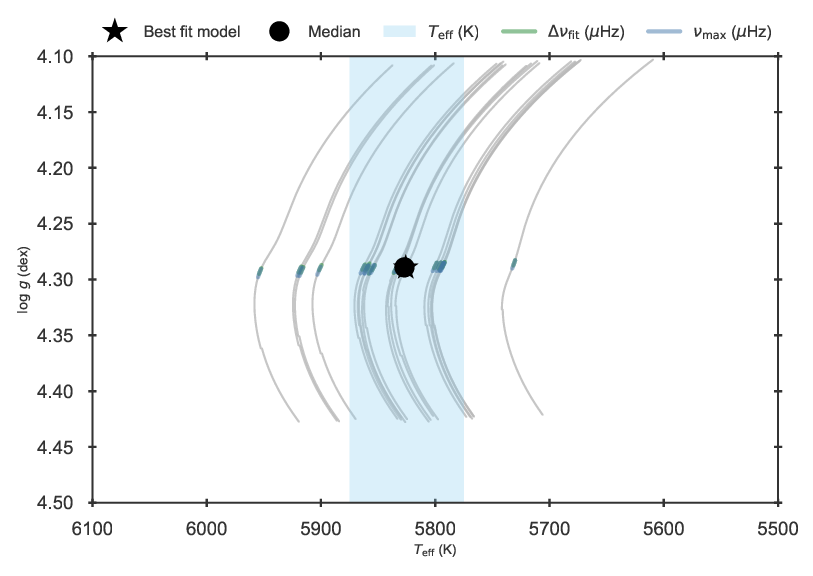

.. _example_global:

Spectroscopy and global asteroseismic parameters
************************************************

This example describes the fitting of what we call global parameters of the grid, with a specific application to
asteroseismology for illustration purposes. As a general recommendation, the user should explore the
:ref:`parameter list <controls_params>` for a complete list of available fitting parameters.

Block 2 of :py:meth:`create_inputfile.define_input` (in ``BASTA/examples/create_inputfile.py``) defines the fitting parameters. For this example it looks as follows:

.. code-block:: python

    # ==================================================================================
    # BLOCK 2: Fitting control
    # ==================================================================================
    define_fit["fitparams"] = ("Teff", "FeH", "dnufit", "numax")

That is, we will fit effective temperature, metallicity [Fe/H], the large frequency separation :math:`\Delta\nu`, and
the frequency of maximum power :math:`\nu_\mathrm{max}`. Note that the input value of :math:`\Delta\nu` is called
``dnu`` in block 1 of :py:meth:`create_inputfile.define_input`, and the parameter we are fitting here is called
``dnufit``. The reason is that BASTA supports several definitions of :math:`\Delta\nu` and it is the user's decision
which one to fit. A description of the various types of :math:`\Delta\nu` available is given in Section 4.1.1 of
`The BASTA paper II <https://arxiv.org/abs/2109.14622>`_, and their corresponding variable
names can be found in the :ref:`parameter list <controls_params>`.

The next block to be modified is 2a, where priors to the fit can be selected. We will apply a Salpeter IMF and flat
priors in :math:`T_\mathrm{eff}` and metallicity, where the likelihoods will be calculated only for models within a
certain tolerance from the observed values of each star:

.. code-block:: python

    # ------------------------------------------------------------
    # BLOCK 2a: Fitting control, priors
    # ------------------------------------------------------------
    define_fit["priors"] = {"Teff": {"sigmacut": "5"}, "FeH": {"abstol": "0.5"}}
    define_fit["priors"] = {**define_fit["priors"], "IMF": "salpeter1955"}

Finally, we define a reference solar model and the assumed solar values:

.. code-block:: python

    # ------------------------------------------------------------
    # BLOCK 2b: Fitting control, solar scaling
    # ------------------------------------------------------------
    define_fit["solarmodel"] = True
    define_fit["sundnu"] = 135.1
    define_fit["sunnumax"] = 3090.0

Note that, in the present example, the solar model is used to scale the grid values of ``dnufit`` as described in
Section 4.1.1 of `The BASTA paper II <https://arxiv.org/abs/2109.14622>`_.

In the folder ``BASTA/examples/xmlinput/`` you can find a file called ``create_inputfile_global.py`` that has been prepared following the above instructions to make a fit of the Kepler target 16 Cyg A to the example grid shipped with
the code. Simply run the following commands on your terminal:

.. code-block:: bash

    cd BASTA
    source venv/bin/activate
    cd examples/xmlinput
    python create_inputfile_global.py

You should see the following output printed in your terminal:

.. code-block:: text

    **********************************************
    *** Generating an XML input file for BASTA ***
    **********************************************

    Reading user input ...
    Done!

    Running sanity checks ...
    Done!

    Creating XML input file 'input_global.xml' ...
    Done!

       Summary of the requested BASTA run
    ----------------------------------------

    A total of 1 star(s) will be fitted with {Teff, FeH, dnufit, numax} to the grid 'BASTADIR/grids/Garstec_16CygA.hdf5'.

    This will output {Teff, FeH, dnufit, numax, radPhot, massfin, age} to a results file.

    Corner plots include {Teff, FeH, dnufit, numax, radPhot, massfin, age} with observational bands on {Teff, FeH, dnufit, numax}.
    Kiel diagrams will be made with observational bands on {Teff, FeH, dnufit, numax}.

    A restricted flat prior will be applied to: Teff, FeH.
    Additionally, a Salpeter1955 IMF will be used as a prior.

    !!! To perform the fit, run the command: BASTArun input_global.xml

Once the file is created, run BASTA as explained to perform the fit:

.. code-block:: bash

    BASTArun input_global.xml

The output of the fit can be found in ``BASTA/examples/output/global/``. It includes a Kiel diagram that should
look like the following:

   Kiel diagram of the 16 Cyg A fit using global asteroseismic quantities.

This figure is **only** a visual aid to understand the results, as it depicts the position of the found median and best fit model within the grid. It also highlights in different colours which parts of the grid agree within the
uncertainties of the inputted ``fitparams``. Note that the number of tracks plotted are selected to lie within the 16
and 84 percentiles mass and metallicity output of the solution, and are **not** the only tracks present in the grid nor the only tracks used for the likelihood calculation.

Finally, a corner plot of the parameters included in ``cornerplots`` is also part of the output:

   Corner plot of the 16 Cyg A fit using global asteroseismic quantities.

Please note that you might get distributions and numbers with tiny variations compared to what is shown above. This is because BASTA is using using a random sampling scheme to obtain the posterior distibutions. If you want to get exactly the same as in the reference examples, add ``--seed 42`` to ``BASTArun``

Finally it should be noted that the distributions are spiky, which are a reflection of the resolution of the grid (and the small uncertainties on asteroseismic parameters). If you consider this to be an issue for your purposes, don't forget to check our section on :ref:`example_interp`.

**Congratulations! You just completed your first fit using BASTA. Easy-peasy, right?**
