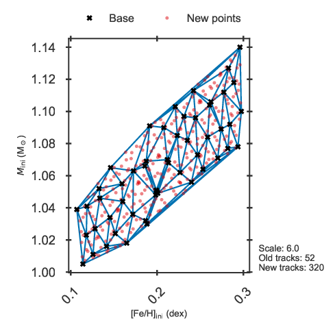
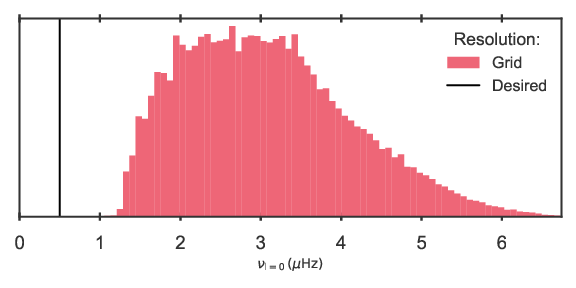
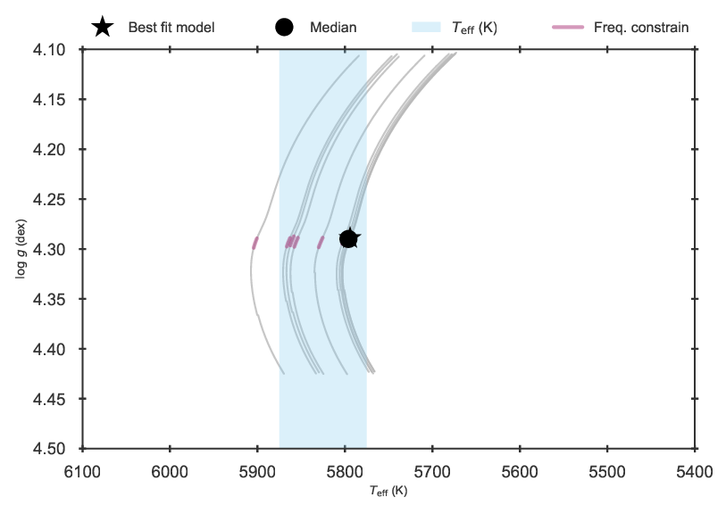
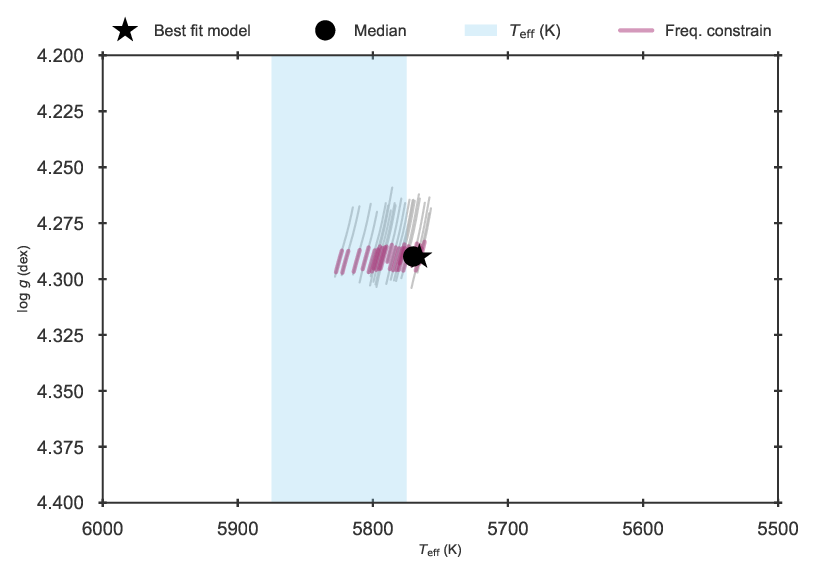
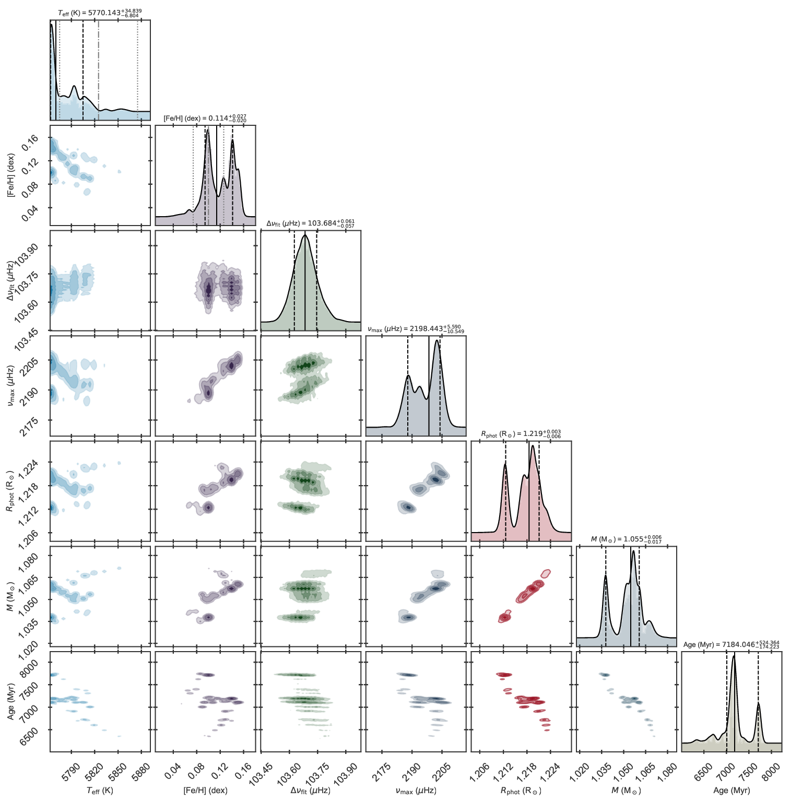

.. _example_interp:

Interpolation of tracks and isochrones
**************************************

If the resolutions of a particular grid is considered insufficient for a particular fit, BASTA includes the option of
performing interpolation across and/or along tracks and isochrones. What the procedure does is to produce a new
interpolated grid of models, store it in ``hdf5`` format, and perform a fit to the input given in ``fitparams``. Since
the new interpolated grid is stored, additional fits can be made without the need of interpolating again just by using
the normal BASTA scripts described in the previous examples (with the appropriate options).

As a general rule, since the interpolation takes place in a restricted parameter space, all scripts given in this
example do not include additional priors than the IMF in block 2a.

Example: main-sequence star and tracks
======================================

In this first example we will use the grid provided with the code for the target 16 Cyg A in
``BASTA/grids/Garstec_16CygA.hdf5``.

Checking/previewing the interpolation
-------------------------------------

Before running the interpolation, we always recommend to check what the original coverage of the grid is, and what would be the resulting coverage given certain values for the interpolation. We have included a script in ``BASTA/examples/preview_interpolation.py`` that serves this purpose, and requires the following input:

.. code-block:: python

    define_input["gridfile"] = os.path.join(
        BASTADIR, "grids", "Garstec_16CygA.hdf5"
    )

    define_input["construction"] = "bystar"

    define_input["limits"] = {
        "Teff": {"abstol": 150},
        "FeH": {"abstol": 0.2},
        "dnufit": {"abstol": 8},
    }

Here we have defined the region of the grid where the interpolation will be carried out. In this case we select models within 150 K in effective temperature, 0.2 dex in [Fe/H], and 8 :math:`\mu \mathrm{Hz}` in large frequency separation of the observed values of 16 Cyg. We also define that the ranges are applied ``bystar``, which is not strictly relevant here as we are only fitting one star, but it is important if more than one target is interpolated at the same time. In that case ``bystar`` produces one interpolated grid per target using the limits defined in ``["limits"]`` for each target, while the ``encompass`` option produces one larger interpolated grid encompassing all targets in the list within the limits set in ``["limits"]``.

The next blocks define the desired resolution along and across tracks/isochrones:

.. code-block:: python

    outpath = os.path.join("output", "preview_interp_MS")
    along_interpolation = True
    if along_interpolation:
        define_along["resolution"] = {
            "freqs": 0.5,
        }
        define_along["figurename"] = os.path.join(
            outpath, "interp_preview_along_resolution.pdf"
        )

The parameters in ``["resolution"]`` define the resolution `along` a given track. In this case we set a value of 0.5
:math:`\mu \mathrm{Hz}` in the individual oscillation frequencies, and what BASTA does is interpolating along a track
such that the lowest observed l=0 mode has the required resolution of 0.5 :math:`\mu \mathrm{Hz}`. All other modes are interpolated accordingly.

Finally, we define the settings for the interpolation `across/between` tracks:

.. code-block:: python

    across_interpolation = True
    if across_interpolation:
        define_across["resolution"] = {
            "scale": 6
        }
        define_across["figurename"] = os.path.join(
            outpath, "interp_preview_across_resolution.pdf"
        )

Since the input grid we are using has been constructed using Sobol sampling, we define a ``scale`` parameter of 5 in
``["resolution"]``, which increases the number of tracks with respect to the original by a factor of 6. The following figures shows the new sampling, and compares the desired resolution to the `current` distributions of parameter values in the grid:

   Distribution in mass and metallicity of the current grid (base) and desired interpolated grid.

   Distribution in individual frequency resolution of the current grid.

Running the fit with interpolation
----------------------------------

If the resolution is satisfactory for your needs, the relevant parameters to be modified in :py:meth:`create_inputfile.define_input` are those given in block 5 of the included example ``create_inputfile_interp_MS.py``.

.. code-block:: python

    # ==================================================================================
    # BLOCK 5: Interpolation
    # ==================================================================================
    interpolation = True
    if interpolation:
        define_intpol["intpolparams"] = {}

        define_intpol["intpolparams"]["limits"] = {
            "Teff": {"abstol": 150},
            "FeH": {"abstol": 0.2},
            "dnufit": {"abstol": 8},
        }

        define_intpol["intpolparams"]["method"] = {
            "case": "combined",
            "construction": "bystar",
        }

        define_intpol["intpolparams"]["name"] = "example"

We define the name of the output grid to be ``intpol_example_16CygA.hdf5``. Next we set the level of refinement in
the interpolation.

.. code-block:: python

        define_intpol["intpolparams"]["gridresolution"] = {
            "scale": 6.0,
            "baseparam": "rhocen",
        }

        define_intpol["intpolparams"]["trackresolution"] = {
            "param": "freqs",
            "value": 0.5,
            "baseparam": "rhocen",
        }

The variable ``baseparam`` defines the property used as base in the interpolation along and across the tracks, which we set in both cases to central density.

Running the ``create_inputfile_interp_MS.py`` script produces the input file `input_interp_MS.xml`. Once BASTA begins
the interpolation you might see messages such as:

.. code-block:: text

    Warning: Interpolating track 270 was aborted due to no overlap in rhocen of the enveloping track!

These are normal and can be safely ignored, as the strict cuts applied in effective temperature and metallicity result
in some tracks having central density values outside the vertices of the interpolation and are therefore ignored. Also, messages like the following can be safely ignored:

.. code-block:: text

    Stopped interpolation along track467 as the number of points would decrease from 24 to 22

This simply states that the track has the required resolution along the track and therefore it does not require
interpolation.

`Please note that performing the interpolation can take a while! With the settings specified above, it takes around 20 minutes on our testing machine`

After the interpolation and fit are performed the results are stored in ``BASTA/examples/output/interp_MS/``,
including the new interpolated grid. The following figures compare the Kiel diagrams of the grids with and without
interpolation, as well as the corner plots.

   Kiel diagram of the 16 Cyg A fit using the original grid.

   Kiel diagram of the 16 Cyg A fit using the interpolated grid.

   Corner plot of the 16 Cyg A fit using the original grid.

   Corner plot of the 16 Cyg A fit using the interpolated grid.
