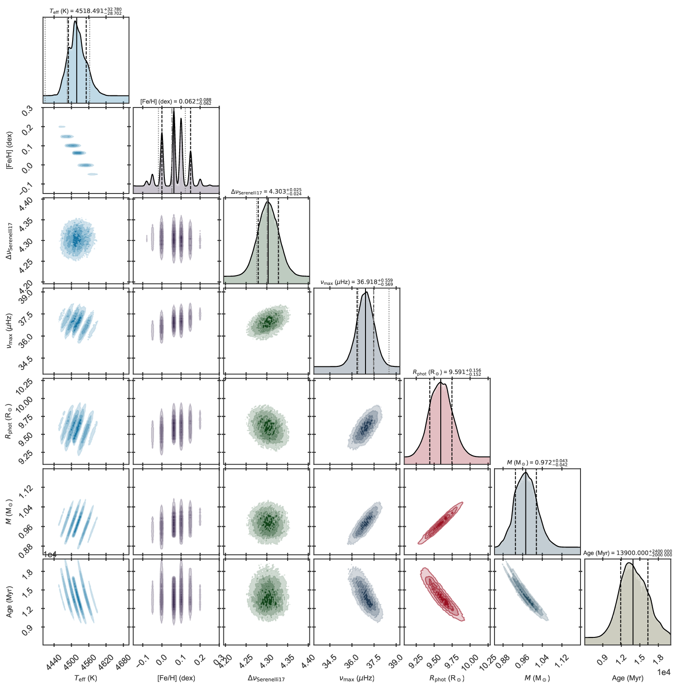
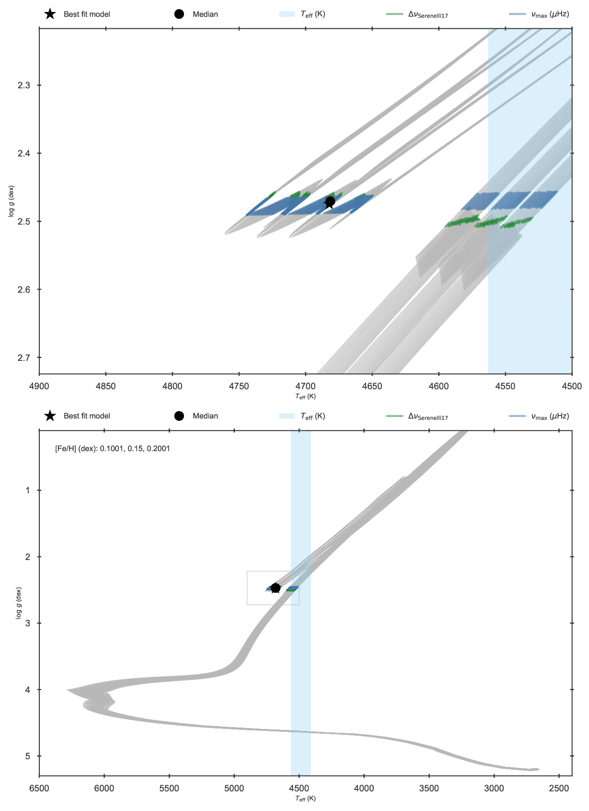

.. _example_isoch:

Isochrones, distances, and evolutionary phase
*********************************************

BASTA is shipped with a complete set of isochrones from the
`BaSTI library <http://basti-iac.oa-abruzzo.inaf.it/index.html>`_. The input physics, science cases, and mixtures are
described in the `Solar scaled paper <https://ui.adsabs.harvard.edu/abs/2018ApJ...856..125H/abstract>`_ and the
`Alpha-enhanced paper <https://ui.adsabs.harvard.edu/abs/2021ApJ...908..102P/abstract>`_. We show here how these
isochrones can be used to determine stellar properties while fitting asteroseismic data, parallaxes, and a prior on the
evolutionary phase of a star.

In ``BASTA/examples/data/`` we have included the file ``Kepler_RGB.ascii``, which contains the global parameters
of the red giant branch star KIC 11129442 observed by the *Kepler* satellite. Besides spectroscopic properties and
asteroseismic observables, the file contains magnitudes in the 2MASS system, parallax from Gaia eDR3, and evolutionary
phase as determined from its asteroseismic period spacing. Necessary changes to :py:meth:`create_inputfile.define_input`
are the following:

.. code-block:: python

    # ==================================================================================
    # BLOCK 1: I/O
    # ==================================================================================
    define_io["gridfile"] = "grids/BaSTI_iso2018.hdf5"

    define_io["asciifile"] = "data/Kepler_RGB.ascii"
    define_io["params"] = (
        "starid",
        "RA",
        "DEC",
        "Teff",
        "Teff_err",
        "FeH",
        "FeH_err",
        "dnu",
        "dnu_err",
        "numax",
        "numax_err",
        "Mj_2MASS",
        "Mj_2MASS_err",
        "Mh_2MASS",
        "Mh_2MASS_err",
        "Mk_2MASS",
        "Mk_2MASS_err",
        "parallax",
        "parallax_err",
        "phase",
    )

Which reads the variables from the input file. To work with the isochrones, block 2c needs to be used for defining the
desired science case:

.. code-block:: python

    # ------------------------------------------------------------
    # BLOCK 2c: Fitting control, isochrones
    # ------------------------------------------------------------
    define_fit["odea"] = (0.2, 0, 0.3, 0)    # + mass loss

This will select the isochrones including overshoot in the main sequence, no microscopic diffusion, with mass-loss, and
no alpha-enhancement.

.. _example_parallax:

Fitting parallax
================

The first fit in this example will include spectroscopy, global asteroseismic parameters, and parallax. The
``fitparams`` entry must be modified:

.. code-block:: python

    # ==================================================================================
    # BLOCK 2: Fitting control
    # ==================================================================================
    define_fit["fitparams"] = ("Teff", "FeH", "dnuSer", "numax", "parallax")

Note that we fit the large frequency separation using the
`Serenelli et al. 2017 correction <https://ui.adsabs.harvard.edu/abs/2017ApJS..233...23S/abstract>`_ (called ``dnuSer``)
instead of ``dnufit`` since theoretical oscillation frequencies are not included in isochrones (see section 4.1.1 of
`The BASTA paper II <https://arxiv.org/abs/2109.14622>`_). In order to fit the parallax,
we need to provide at least one apparent magnitude. This is done modifying block 2e as follows:

.. code-block:: python

    # ------------------------------------------------------------
    # BLOCK 2e: Fitting control, distances
    # ------------------------------------------------------------

    define_fit["filters"] = ("Mj_2MASS", "Mh_2MASS", "Mk_2MASS")

    define_fit["dustframe"] = "icrs"

We will use all 3 apparent magnitudes from 2MASS and we specify the reference frame for the input coordinates. Note that
BASTA will use the `Green et al. dustmap <http://argonaut.skymaps.info>`_ to determine extincion based on the
coordinates and parallax. By default BASTA will try to make an online query for the extinction values (it is faster),
and if you are not connected to the internet it will use the local dustmap downloaded as part of the installation.

Finally, remember to turn-off the settings for plotting individual frequencies, as these are not included in an
isochrones library:

.. code-block:: python

    # ==================================================================================
    # BLOCK 4: Plotting control
    # ==================================================================================

    define_plots["freqplots"] = False

The file ``BASTA/examples/xmlinput/create_inputfile_parallax.py`` has been modified accordingly to produce a fit
to the isochrones. After running the associated ``input_parallax.xml`` the output should look as follows:

   Kiel diagram of the fit to KIC 11129442 including asteroseismology and parallaxes.

   Corner plot of the fit to KIC 11129442 including asteroseismology and parallaxes.

You may have noticed that there is one additional figure to this fit that has not appeared before. This is the corner
plot of the parameters associated to the distance called ``11129442_distance_corner.pdf`` and looks like this:

   Corner plot of distance properties of the fit to KIC 11129442 including asteroseismology and parallaxes.

In this figure you can inspect the distance distributions and absorptions determined for each magnitude, as well as the
joint distance and extinction distributions. To activate this additional output, the parameter ``distance`` must be
included in **both** ``define_output["outparams"]`` and ``define_plots["cornerplots"]``. The example file
``BASTA/examples/xmlinput/create_inputfile_parallax.py`` uses the same parameters in both cases and the plot is
produced.

.. _example_dist_estimate:

Estimating distance
===================

One additional feature of BASTA is that distances can be predicted when fitting any quantity. The only requirement is
that in addition to ``fitparams`` the user must specify (at least) one apparent magnitude to use in the distance
estimation and provide the target coordinates.

The file ``BASTA/examples/xmlinput/create_inputfile_distance.py`` contains the modifications to
:py:meth:`create_inputfile.define_input` to produce this fit. The differences with the case of fitting parallax are that
parallax must not be present in ``fitparams``:

.. code-block:: python

    # ==================================================================================
    # BLOCK 2: Fitting control
    # ==================================================================================
    define_fit["fitparams"] = ("Teff", "FeH", "dnuSer", "numax")

At least one magnitude must be specified (and of course its observed value and uncertainty should be included in the
``ascii`` file containing the inout data). In this case we will use only the 2MASS *J* magnitude:

.. code-block:: python

    # ------------------------------------------------------------
    # BLOCK 2e: Fitting control, distances
    # ------------------------------------------------------------
    define_fit["filters"] = ("Mj_2MASS")

And finally the parameter ``distance`` must be included in the output parameters:

.. code-block:: python

    # ==================================================================================
    # BLOCK 3: Output control
    # ==================================================================================
    define_output["outparams"] = ("Teff", "FeH", "dnuSer", "numax", "radPhot", "massfin", "age", "distance")

The distance corner plot including only the *J* magnitude looks as follows:

   Distance corner plot for KIC 11129442 estimated using asteroseismology, spectroscopy, and one apparent magnitude.

The derived distance is consistent with the value obtained when parallaxes are included.

Fitting evolutionary phase
==========================

BASTA offers the possibility of imposing a certain evolutionary phase for a star when this information is known from
e.g., asteroseismic observations. The target KIC 11129442 used in the examples above is clearly an RGB star, and this
information is included in the final column of ``BASTA/examples/data/Kepler_RGB.ascii`` as ``phase``. In the
previous fits this information has not been explicitely used, so we show here an example of how to force the star
to be in the red clump phase instead of in the RGB.

The BaSTI isochrones have evolutionary phases assigned following the standarized *Key Points* given in Table 4 of the
`Solar scaled paper <https://ui.adsabs.harvard.edu/abs/2018ApJ...856..125H/abstract>`_. Briefly, BASTA names the
evolutionary phases as follows:

* ``pre-ms``: models [1,99], from *Key Point* 1 to *Key Point* 4 (Zero-age main sequence)
* ``solar``: models [100,489], from *Key Point* 4 to *Key Point* 8 (Base of the RGB for low-mass models)
* ``rgb``: models [490,1289], from *Key Point* 8 to *Key Point* 11 (Tip of the RGB)
* ``flash``: models [1290,1299], from *Key Point* 11 to *Key Point* 12 (Start of quiescent core He burning)
* ``clump``: models [1300,1949], from *Key Point* 12 to *Key Point* 18 (Central abundance of He equal to 0.00)
* ``agb``: models [1950,2100], from *Key Point* 18 to *Key Point* 19

In order to see the effects, we recommend you modify the ``phase`` column in
``BASTA/examples/data/Kepler_RGB.ascii`` by replacing ``rgb`` by ``clump`` -- or just use the file ``Kepler_RGB_change-phase-to-RC.ascii`` where that change has been applied. The file
``BASTA/examples/xmlinput/create_inputfile_phase.py`` contains the settings for an example of this fitting
procedure. The only difference (except for reading the pre-modified data file) is the inclusion of ``phase`` in ``fitparams``:

.. code-block:: python

    define_fit["fitparams"] = ("Teff", "FeH", "dnuSer", "numax", "phase")

The resulting fit is displayed in the following Kiel diagram where it is clear that the red clump phase has been
selected instead of the RGB

   Kiel diagram of the fit to KIC 11129442 forcing the star into the red clump.
